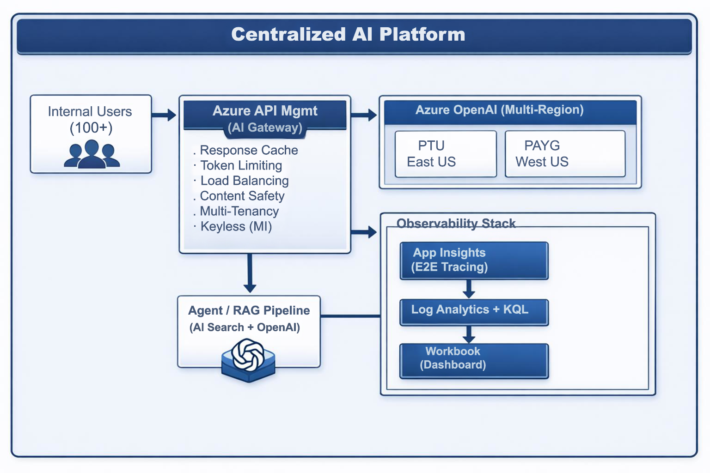

# Azure AI Insight Hub — Design / Workshop

## Central AI  Hub Architecture: Secure, Observable, and Scalable AI Platform

This POC demonstrates an end-to-end AI platform built on **Azure API Management (AI Gateway)**, **Application Insights**, and **Azure OpenAI** — delivering centralized LLM governance, full observability, and scalable multi-tenant access for 1000+ internal users.

---

## Architecture Overview




```
┌─────────────────────────────────────────────────────────────────────────────┐
│                          Centralized AI Platform                             │
│                                                                             │
│  ┌──────────┐    ┌──────────────────┐    ┌────────────────────────────────┐ │
│  │ Internal  │───▶│  Azure API Mgmt  │───▶│  Azure OpenAI (Multi-Region) │ │
│  │  Users    │    │  (AI Gateway)    │    │  ┌─────────┐  ┌───────────┐  │ │
│  │ (1000+)   │    │                  │    │  │ PTU     │  │ PAYG      │  │ │
│  └──────────┘    │ • Response Cache  │    │  │ East US │  │ West US   │  │ │
│                  │ • Token Limiting  │    │  └─────────┘  └───────────┘  │ │
│                  │ • Load Balancing  │    └────────────────────────────────┘ │
│                  │ • Content Safety  │                                       │
│                  │ • Multi-Tenancy   │    ┌────────────────────────────────┐ │
│                  │ • Keyless (MI)    │    │  Observability Stack           │ │
│                  └──────────────────┘    │  ┌──────────────┐              │ │
│                         │                │  │ App Insights │              │ │
│                         │                │  │ (E2E Tracing)│              │ │
│                         ▼                │  └──────┬───────┘              │ │
│                  ┌──────────────┐        │         │                      │ │
│                  │ Agent / RAG  │        │  ┌──────▼───────┐              │ │
│                  │ Pipeline     │────────│  │ Log Analytics│              │ │
│                  │ (AI Search + │        │  │ + KQL        │              │ │
│                  │  OpenAI)     │        │  └──────┬───────┘              │ │
│                  └──────────────┘        │  ┌──────▼───────┐              │ │
│                                          │  │  Workbook   │              │ │
│                                          │  │ (Dashboard) │              │ │
│                                          │  └──────────────┘              │ │
│                                          └────────────────────────────────┘ │
└─────────────────────────────────────────────────────────────────────────────┘
```

---

## Key Benefits

| Benefit | Description |
|---------|-------------|
| **Centralized LLM Governance** | Replace ad-hoc Azure OpenAI deployments with a single AI Gateway that enforces consistent policies, access controls, and usage limits across all teams. |
| **Full End-to-End Observability** | Distributed tracing from user query → APIM → Azure OpenAI and back, with correlated traces in Application Insights and KQL-powered dashboards for real-time monitoring. |
| **Per-Team Cost Control** | Token-based rate limiting and tiered subscriptions (Free / Standard / Premium) enable chargeback, prevent runaway consumption, and ensure fair resource allocation. |
| **Multi-Region Resilience** | Weighted load balancing across PTU (East US) and PAYG (West US) endpoints with automatic failover on 429/throttle — ensuring high availability under load. |
| **Zero Key Management** | Managed Identity (keyless) authentication eliminates API key rotation, reduces secret sprawl, and strengthens security posture. |
| **Cost Optimization** | Exact-match response caching reduces redundant LLM calls; PTU-first routing lowers per-token cost while PAYG handles burst traffic. |
| **Infrastructure as Code** | Entire platform deployed via Bicep modules — repeatable, auditable, and version-controlled. No portal click-ops required. |
| **Scalable Multi-Tenancy** | APIM subscriptions and products provide per-team isolation, usage tracking, and independent rate limits — ready to scale from 100 to 3,800+ users. |
| **Production-Ready RAG Pipeline** | Pre-built agent app (Python & Node.js) with Azure AI Search vector/hybrid search, OpenTelemetry instrumentation, and AI Gateway integration. |

---

## Use Cases

| Use Case | Description |
|----------|-------------|
| **Enterprise AI Copilot Platform** | Serve a centralized copilot experience to thousands of internal users — HR bots, IT helpdesks, legal assistants — all routed through a single governed AI Gateway. |
| **Internal Knowledge Search (RAG)** | Enable employees to ask natural-language questions over company wikis, policies, and documentation using Azure AI Search + Azure OpenAI with grounded, citation-backed answers. |
| **Multi-Team LLM Chargeback** | Track and bill AI usage per department or product team using APIM subscriptions, token metrics, and tiered rate limits — turning a shared AI service into a metered internal platform. |
| **Regulated Industry AI Deployment** | Enforce content safety filters, prompt/response logging, and audit trails required by financial services, healthcare, and government compliance frameworks. |
| **AI-Powered Customer Support** | Build agent pipelines that retrieve relevant support articles via vector search, generate context-aware responses, and log every interaction for quality review. |
| **Cost-Controlled AI Experimentation** | Give dev teams sandbox access with Free-tier rate limits while production workloads use Premium PTU-backed endpoints — all managed through a single control plane. |
| **Multi-Region High-Availability AI** | Serve latency-sensitive AI workloads across geographies with automatic failover between PTU and PAYG endpoints, ensuring uptime during regional outages or throttling events. |
| **SRE Observability for LLM Ops** | Stream AI telemetry (token counts, latency, error rates) to existing monitoring stacks like New Relic, Datadog, or Splunk via Event Hub export for unified SRE dashboards. |

---

## Prerequisites

| Requirement | Details |
|-------------|---------|
| Azure Subscription | Owner or Contributor + User Access Administrator |
| Azure CLI | v2.60+ (`az --version`) |
| Bicep CLI | v0.28+ (`az bicep version`) |
| Python | 3.10+ (for agent/RAG app) |
| VS Code | With Azure Tools, Bicep extensions |
| Azure OpenAI Access | GPT-4o and text-embedding-ada-002 models approved |

---

## Quick Start

```powershell
# 1. Clone this repo
git clone <repo-url>
cd azure-ai-insight-hub

# 2. Login to Azure
az login
az account set --subscription "<your-subscription-id>"

# 3. Start with Phase 1
# Follow docs/phase-1-foundation-infra.md
```

---

## Repository Structure

```
azure-ai-insight-hub/
├── README.md                          # This file
├── usecase.txt                        # Original use case description
├── docs/
│  
├── infra/
│   ├── main.bicep                     # Main Bicep orchestrator
│   ├── main.bicepparam                # Parameter file
│   └── modules/
│       ├── apim.bicep                 # APIM + AI Gateway
│       ├── openai.bicep               # Azure OpenAI (multi-region)
│       ├── monitoring.bicep           # App Insights + Log Analytics
│       ├── search.bicep               # AI Search for RAG
├── policies/
│   ├── ai-gateway-global.xml          # Global APIM policies
│   ├── ai-gateway-api.xml             # API-level policies
│   └── ai-gateway-operations.xml      # Operation-level policies
└── src/
    ├── agent-app/                     # Python agent/RAG application
    │   ├── app.py
    │   ├── requirements.txt
    │   └── ...
    └── agent-app-node/                # Node.js agent/RAG application (alternative)
        ├── src/
        │   ├── app.js
        │   └── ...
        └── package.json
```

---

## Key Design Decisions

| Decision | Rationale |
|----------|-----------|
| **Bicep over Portal** | IaC-first approach — repeatable, auditable, version-controlled |
| **APIM as AI Gateway** | Single control plane for all LLM access — no ad-hoc deployments |
| **Managed Identity** | Keyless access — no API keys to rotate or leak |
| **PTU + PAYG load balancing** | Cost optimization: PTU for baseline, PAYG for burst |
| **Subscription-based multi-tenancy** | Per-team isolation, rate limits, and chargeback via APIM subscriptions |

---

## License

This project is for workshop/POC purposes. See individual service terms for Azure resource usage.
