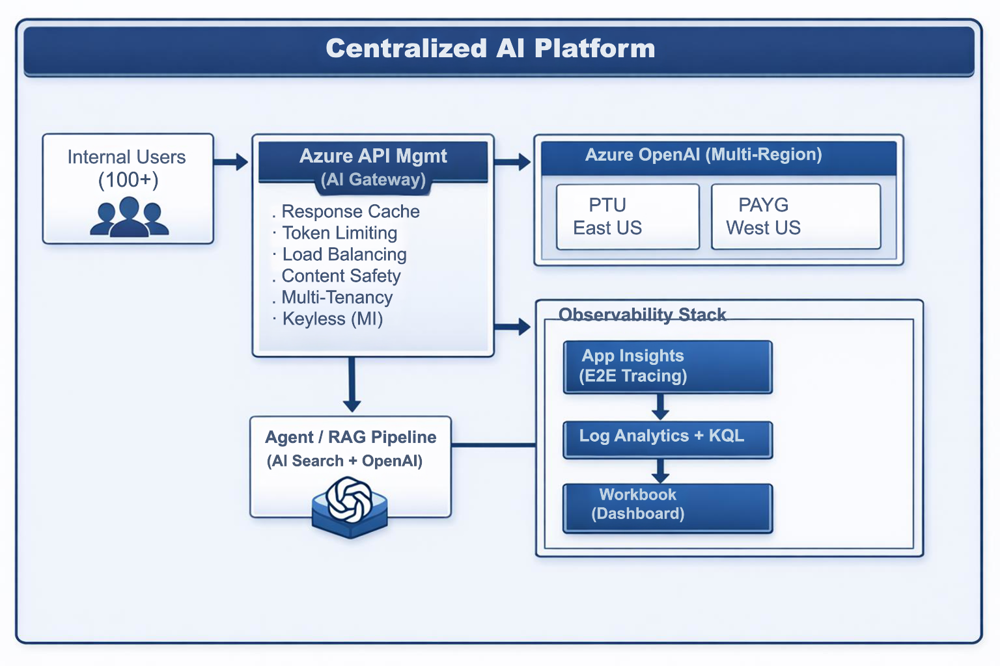

# Azure AI Insight Hub — Design / Workshop

## Central AI  Hub Architecture: Secure, Observable, and Scalable AI Platform

This POC demonstrates an end-to-end AI platform built on **Azure API Management (AI Gateway)**, **Application Insights**, and **Azure OpenAI** — delivering centralized LLM governance, full observability, and scalable multi-tenant access for 1000+ internal users.

---

## Architecture Overview




```
┌─────────────────────────────────────────────────────────────────────────────┐
│                          Centralized AI Platform                             │
│                                                                             │
│  ┌──────────┐    ┌──────────────────┐    ┌────────────────────────────────┐ │
│  │ Internal  │───▶│  Azure API Mgmt  │───▶│  Azure OpenAI (Multi-Region) │ │
│  │  Users    │    │  (AI Gateway)    │    │  ┌─────────┐  ┌───────────┐  │ │
│  │ (1000+)   │    │                  │    │  │ PTU     │  │ PAYG      │  │ │
│  └──────────┘    │ • Response Cache  │    │  │ East US │  │ West US   │  │ │
│                  │ • Token Limiting  │    │  └─────────┘  └───────────┘  │ │
│                  │ • Load Balancing  │    └────────────────────────────────┘ │
│                  │ • Content Safety  │                                       │
│                  │ • Multi-Tenancy   │    ┌────────────────────────────────┐ │
│                  │ • Keyless (MI)    │    │  Observability Stack           │ │
│                  └──────────────────┘    │  ┌──────────────┐              │ │
│                         │                │  │ App Insights │              │ │
│                         │                │  │ (E2E Tracing)│              │ │
│                         ▼                │  └──────┬───────┘              │ │
│                  ┌──────────────┐        │         │                      │ │
│                  │ Agent / RAG  │        │  ┌──────▼───────┐              │ │
│                  │ Pipeline     │────────│  │ Log Analytics│              │ │
│                  │ (AI Search + │        │  │ + KQL        │              │ │
│                  │  OpenAI)     │        │  └──────┬───────┘              │ │
│                  └──────────────┘        │  ┌──────▼───────┐              │ │
│                                          │  │  Workbook   │              │ │
│                                          │  │ (Dashboard) │              │ │
│                                          │  └──────────────┘              │ │
│                                          └────────────────────────────────┘ │
└─────────────────────────────────────────────────────────────────────────────┘
```

---

## Key Benefits

| Benefit | Description |
|---------|-------------|
| **Centralized LLM Governance** | Replace ad-hoc Azure OpenAI deployments with a single AI Gateway that enforces consistent policies, access controls, and usage limits across all teams. |
| **Full End-to-End Observability** | Distributed tracing from user query → APIM → Azure OpenAI and back, with correlated traces in Application Insights and KQL-powered dashboards for real-time monitoring. |
| **Per-Team Cost Control** | Token-based rate limiting and tiered subscriptions (Free / Standard / Premium) enable chargeback, prevent runaway consumption, and ensure fair resource allocation. |
| **Multi-Region Resilience** | Weighted load balancing across PTU (East US) and PAYG (West US) endpoints with automatic failover on 429/throttle — ensuring high availability under load. |
| **Zero Key Management** | Managed Identity (keyless) authentication eliminates API key rotation, reduces secret sprawl, and strengthens security posture. |
| **Cost Optimization** | Exact-match response caching reduces redundant LLM calls; PTU-first routing lowers per-token cost while PAYG handles burst traffic. |
| **Infrastructure as Code** | Entire platform deployed via Bicep modules — repeatable, auditable, and version-controlled. No portal click-ops required. |
| **Scalable Multi-Tenancy** | APIM subscriptions and products provide per-team isolation, usage tracking, and independent rate limits — ready to scale from 100 to 3,800+ users. |
| **Production-Ready RAG Pipeline** | Pre-built agent app (Python & Node.js) with Azure AI Search vector/hybrid search, OpenTelemetry instrumentation, and AI Gateway integration. |

---

## Use Cases

| Use Case | Description |
|----------|-------------|
| **Enterprise AI Copilot Platform** | Serve a centralized copilot experience to thousands of internal users — HR bots, IT helpdesks, legal assistants — all routed through a single governed AI Gateway. |
| **Internal Knowledge Search (RAG)** | Enable employees to ask natural-language questions over company wikis, policies, and documentation using Azure AI Search + Azure OpenAI with grounded, citation-backed answers. |
| **Multi-Team LLM Chargeback** | Track and bill AI usage per department or product team using APIM subscriptions, token metrics, and tiered rate limits — turning a shared AI service into a metered internal platform. |
| **Regulated Industry AI Deployment** | Enforce content safety filters, prompt/response logging, and audit trails required by financial services, healthcare, and government compliance frameworks. |
| **AI-Powered Customer Support** | Build agent pipelines that retrieve relevant support articles via vector search, generate context-aware responses, and log every interaction for quality review. |
| **Cost-Controlled AI Experimentation** | Give dev teams sandbox access with Free-tier rate limits while production workloads use Premium PTU-backed endpoints — all managed through a single control plane. |
| **Multi-Region High-Availability AI** | Serve latency-sensitive AI workloads across geographies with automatic failover between PTU and PAYG endpoints, ensuring uptime during regional outages or throttling events. |
| **SRE Observability for LLM Ops** | Stream AI telemetry (token counts, latency, error rates) to existing monitoring stacks like New Relic, Datadog, or Splunk via Event Hub export for unified SRE dashboards. |

---

## Prerequisites

| Requirement | Details |
|-------------|---------|
| Azure subscription | **Owner**, or **Contributor** plus **User Access Administrator**, so you can deploy resources and create role assignments |
| Azure CLI | v2.60 or later (`az --version`) |
| Bicep CLI | v0.28 or later (`az bicep version`) |
| Azure OpenAI access | Quota for `gpt-4o` (GlobalStandard by default) and `text-embedding-ada-002` (Standard by default) in both configured regions — see Step 4 |
| App runtime | Python 3.10+ **or** Node.js 18+ |
| Git | Required to clone the repository |
| VS Code | Recommended with the Azure Tools and Bicep extensions |

> **Cost notice:** This deployment creates billable Azure resources, including an API Management Standard v2 instance, two Azure OpenAI resources, Azure AI Search, Log Analytics, and Application Insights. Review current Azure pricing and delete the resource group after the workshop if it is no longer required.

---

## Setup Instructions

### Step 1 — Clone the Repository

1. Open PowerShell.
2. Clone the repository and move into its root folder:

```powershell
git clone https://github.com/dhavalshah01/azure-ai-insight-hub.git
cd azure-ai-insight-hub
```

### Step 2 — Verify the Required Tools

1. Confirm that Git, Azure CLI, Bicep, and your chosen application runtime are available:

```powershell
git --version
az --version
az bicep version
python --version
node --version
```

2. You need either Python or Node.js; both are not required.
3. If Bicep is not installed, install it through Azure CLI:

```powershell
az bicep install
```

### Step 3 — Sign In and Select an Azure Subscription

1. Sign in to Azure:

```powershell
az login
```

2. List the subscriptions available to your account:

```powershell
az account list --output table
```

3. Select the subscription that will contain the workshop resources:

```powershell
az account set --subscription "<your-subscription-id>"
az account show --output table
```

### Step 4 — Configure the Deployment Parameters

1. Open `infra/main.bicepparam`.
2. Review and update these values:

   - `environmentName` — Prefix used for every resource name (for example `apim-<environmentName>`). Choose a short, unique value.
   - `location` — Primary Azure region.
   - `secondaryLocation` — Secondary Azure region.
   - `apimPublisherEmail` — Email address shown in API Management.
   - `apimPublisherName` — Organization or workshop name shown in API Management.

3. Optionally add these parameters (defaults are shown):

```bicep
param searchDataPrincipalId = ''            // Empty = the identity running the deployment
param agentSubscriptionName = 'workshop-agent'
param chatModelSku = 'GlobalStandard'       // Standard | GlobalStandard | DataZoneStandard
param chatModelCapacity = 30                // gpt-4o TPM (thousands) per region
param embeddingModelSku = 'Standard'        // Standard | GlobalStandard | DataZoneStandard
param embeddingModelCapacity = 30           // text-embedding-ada-002 TPM (thousands) per region
param teamSubscriptions = [                 // Per-team subscriptions for the multi-tenancy demo
  { name: 'rate-limit-tester', displayName: 'Rate Limit Tester', productId: 'free' }
  { name: 'member-services', displayName: 'Member Services', productId: 'standard' }
  { name: 'digital-banking', displayName: 'Digital Banking', productId: 'standard' }
  { name: 'lending-team', displayName: 'Lending Team', productId: 'premium' }
]
```

   - `searchDataPrincipalId` — Entra ID object ID that receives Azure AI Search access for running the sample apps. Leave it empty to grant access to the account that runs the deployment.
   - `agentSubscriptionName` — Name of the APIM subscription created for the agent apps.
   - `chatModelSku` / `embeddingModelSku` — Deployment type for each model. `GlobalStandard` routes traffic through Azure's global capacity and usually has the most default quota. Use `DataZoneStandard` if processing must stay within the US or EU data zone, or `Standard` for regional processing when you have regional quota.
   - `chatModelCapacity` / `embeddingModelCapacity` — Tokens-per-minute (in thousands) requested for each model in **each** region.
   - `teamSubscriptions` — APIM subscriptions created for each team. `productId` must be `free`, `standard`, or `premium`; it decides the team's token limit. Override this parameter only if you want different team names or tiers.

4. Confirm that both selected regions support the model names and versions defined in `infra/modules/openai.bicep`.
5. Check that your subscription has enough quota for the selected SKU in **both** regions:

```powershell
foreach ($region in "eastus", "westus") {
  Write-Host "=== $region ==="
  az cognitiveservices usage list `
    --location $region `
    --query "[?name.value=='OpenAI.GlobalStandard.gpt-4o' || name.value=='OpenAI.Standard.text-embedding-ada-002'].{quota:name.value, used:currentValue, limit:limit}" `
    --output table
}
```

   - `limit` minus `used` must be at least the capacity you set (default `30`).
   - If you change `chatModelSku` or `embeddingModelSku`, change the quota names in the query to match (for example `OpenAI.DataZoneStandard.gpt-4o`).
   - If the available quota is `0`, choose another SKU or region, or request more quota in the Azure AI Foundry portal under **Quotas**.

> **Important:** Azure resource names must be globally unique. If `ayka-poc` is already in use, choose a different `environmentName`. The APIM policy reads the Azure OpenAI endpoints from APIM named values, so no policy edits are required.

### Step 5 — Create the Resource Group

1. Set reusable PowerShell variables:

```powershell
$RESOURCE_GROUP = "rg-ayka-ai-platform"
$LOCATION = "eastus"
$DEPLOYMENT_NAME = "azure-ai-insight-hub"
```

2. Create the resource group:

```powershell
az group create `
  --name $RESOURCE_GROUP `
  --location $LOCATION
```

### Step 6 — Validate and Deploy the Infrastructure

A single Bicep deployment provisions and configures the entire platform:

| Area | What the deployment creates |
|------|-----------------------------|
| Monitoring | Log Analytics workspace, Application Insights (custom metrics with dimensions enabled), and the observability workbook |
| Azure OpenAI | Primary and secondary accounts with `gpt-4o` (GlobalStandard by default) and `text-embedding-ada-002` (Standard by default) deployments |
| Azure AI Search | Search service with Entra ID (RBAC) authentication enabled |
| API Management | APIM instance, managed identity, Application Insights logger, and diagnostics with custom metrics enabled (required for the per-team token metrics) |
| AI Gateway API | `azure-openai-api` with chat completion and embedding operations |
| APIM policies | Global policy (`policies/ai-gateway-global.xml`) and API policy (`policies/ai-gateway-api.xml`) |
| Named values | `openai-primary-url` and `openai-secondary-url`, used by the load-balancing and failover policy |
| APIM subscription | API-scoped `workshop-agent` subscription for the sample apps |
| APIM products | `Free` (500 TPM), `Standard` (5,000 TPM), and `Premium` (200,000 TPM) products, each published with the AI Gateway API |
| Team subscriptions | Product-scoped `rate-limit-tester` (Free), `member-services` and `digital-banking` (Standard), and `lending-team` (Premium) subscriptions for the multi-tenancy demo |
| Role assignments | **Cognitive Services OpenAI User** for the APIM identity on both OpenAI accounts, plus **Search Service Contributor** and **Search Index Data Contributor** for the app user on AI Search |

1. Validate the Bicep deployment before creating resources:

```powershell
az deployment group validate `
  --resource-group $RESOURCE_GROUP `
  --template-file .\infra\main.bicep `
  --parameters .\infra\main.bicepparam
```

2. Preview the resources and configuration changes:

```powershell
az deployment group what-if `
  --resource-group $RESOURCE_GROUP `
  --template-file .\infra\main.bicep `
  --parameters .\infra\main.bicepparam
```

3. Deploy the infrastructure:

```powershell
az deployment group create `
  --name $DEPLOYMENT_NAME `
  --resource-group $RESOURCE_GROUP `
  --template-file .\infra\main.bicep `
  --parameters .\infra\main.bicepparam
```

   - The first deployment typically takes 30–60 minutes, mostly for API Management.
   - The deployment is idempotent; you can re-run it safely after changing a Bicep file or a policy XML file.

> **Note:** Your account needs permission to create role assignments (**Owner**, or **User Access Administrator** in addition to **Contributor**). Without it, the `role-assignments` module fails with an authorization error.

> **Troubleshooting `InsufficientQuota`:** If validation reports `This operation require 30 new capacity in quota Tokens Per Minute (thousands) - gpt-4o, which is bigger than the current available capacity 0`, your subscription has no quota for the selected deployment SKU in that region. Re-run the quota check in Step 4, then change `chatModelSku`, `chatModelCapacity`, or the regions in `infra/main.bicepparam` to use quota you have.

> **Troubleshooting a partial failure:** If the deployment fails after some resources are created (for example, an APIM policy validation error), fix the cause and run the same `az deployment group create` command again. Resources that already exist are updated in place, and modules that were skipped (such as `role-assignments`, which runs after APIM) are deployed.
>
> If you edit `policies/ai-gateway-api.xml`, don't use `//` comments inside attribute expressions such as `value="@{ ... }"`. XML converts the line breaks in attribute values to spaces, so a `//` comment hides the rest of the code block and APIM rejects the policy. Use XML comments (`<!-- ... -->`) outside the element instead.

### Step 7 — Capture the Deployment Outputs and Subscription Key

1. Save the deployment outputs into PowerShell variables:

```powershell
$OUTPUTS = az deployment group show `
  --name $DEPLOYMENT_NAME `
  --resource-group $RESOURCE_GROUP `
  --query properties.outputs | ConvertFrom-Json

$APIM_NAME = $OUTPUTS.apimName.value
$APIM_GATEWAY_URL = $OUTPUTS.apimGatewayUrl.value
$APIM_SUBSCRIPTION_NAME = $OUTPUTS.apimAgentSubscriptionName.value
$SEARCH_ENDPOINT = $OUTPUTS.searchEndpoint.value
$APPINSIGHTS_CONNECTION_STRING = $OUTPUTS.appInsightsConnectionString.value
```

2. Retrieve the primary key of the APIM subscription created by the deployment:

```powershell
$AZURE_SUBSCRIPTION_ID = az account show --query id --output tsv

$APIM_SUBSCRIPTION_KEY = az rest `
  --method post `
  --uri "https://management.azure.com/subscriptions/$AZURE_SUBSCRIPTION_ID/resourceGroups/$RESOURCE_GROUP/providers/Microsoft.ApiManagement/service/$APIM_NAME/subscriptions/$APIM_SUBSCRIPTION_NAME/listSecrets?api-version=2024-05-01" `
  --query primaryKey `
  --output tsv
```

   - The key is intentionally not returned as a deployment output, because deployment outputs are stored in plain text in the deployment history.

> **Security:** Treat the APIM subscription key as a secret. Store it only in the local `.env` file, which is excluded by `.gitignore`. Do not paste it into documentation or commit it to Git.

### Step 8 — Verify the Automated Configuration

1. Confirm that the AI Gateway API and its operations exist:

```powershell
az apim api operation list `
  --service-name $APIM_NAME `
  --resource-group $RESOURCE_GROUP `
  --api-id $OUTPUTS.apimApiName.value `
  --query "[].{name:name, method:method, url:urlTemplate}" `
  --output table
```

2. Confirm that the named values used by the policy contain your Azure OpenAI endpoints:

```powershell
az apim nv list `
  --service-name $APIM_NAME `
  --resource-group $RESOURCE_GROUP `
  --query "[].{name:displayName, value:value}" `
  --output table
```

3. Confirm that the tiered products and team subscriptions exist:

```powershell
az apim product list `
  --service-name $APIM_NAME `
  --resource-group $RESOURCE_GROUP `
  --query "[].{id:name, name:displayName, state:state}" `
  --output table

az rest `
  --method get `
  --uri "https://management.azure.com/subscriptions/$AZURE_SUBSCRIPTION_ID/resourceGroups/$RESOURCE_GROUP/providers/Microsoft.ApiManagement/service/$APIM_NAME/subscriptions?api-version=2024-05-01" `
  --query "value[].{name:name, displayName:properties.displayName, scope:properties.scope}" `
  --output table
```

   - You should see the `free`, `standard`, and `premium` products.
   - Each team subscription scope should end with `/products/<productId>`. Product-scoped subscriptions are required for the tiered limits; an API-scoped subscription (such as `workshop-agent`) always gets the Standard limit because the request is not linked to a product.

4. Confirm the role assignments on Azure AI Search:

```powershell
$SEARCH_ID = az search service show `
  --name $OUTPUTS.searchName.value `
  --resource-group $RESOURCE_GROUP `
  --query id --output tsv

az role assignment list `
  --scope $SEARCH_ID `
  --query "[].{role:roleDefinitionName, principal:principalName}" `
  --output table
```

5. After the first deployment, wait several minutes for the new role assignments to propagate before creating the search index in the next step.

### Step 9 — Configure and Run an Agent App

Choose either the Python app or the Node.js app.

#### Option A — Python

1. Move to the Python app folder and create a virtual environment:

```powershell
Set-Location .\src\agent-app
python -m venv .venv
.\.venv\Scripts\Activate.ps1
python -m pip install --upgrade pip
pip install -r requirements.txt
```

2. Create the local environment file from the example:

```powershell
Copy-Item .env.example .env
```

3. Update `.env` with the values captured in the previous steps:

```text
APIM_GATEWAY_URL=<value of $APIM_GATEWAY_URL>
APIM_SUBSCRIPTION_KEY=<value of $APIM_SUBSCRIPTION_KEY>
SEARCH_ENDPOINT=<value of $SEARCH_ENDPOINT>
SEARCH_INDEX_NAME=macu-knowledge-base
APPLICATIONINSIGHTS_CONNECTION_STRING=<value of $APPINSIGHTS_CONNECTION_STRING>
CHAT_MODEL=gpt-4o
EMBEDDING_MODEL=text-embedding-ada-002
OPENAI_API_VERSION=2024-10-21
```

4. Create the search index, upload the sample documents, and start the app:

```powershell
python .\setup_search_index.py
uvicorn app:app --host 0.0.0.0 --port 8000 --reload
```

5. See `src/agent-app/setup.md` for detailed test cases and troubleshooting, including the fix for `CERTIFICATE_VERIFY_FAILED` errors on networks with a TLS-inspection proxy or VPN.

#### Option B — Node.js

1. Move to the Node.js app folder and install dependencies:

```powershell
Set-Location .\src\agent-app-node
npm install
Copy-Item .env.example .env
```

2. Update `.env` with the same values shown in the Python option. Keep `PORT=8000`.
3. If your network uses a TLS-inspection proxy or VPN (for example Palo Alto GlobalProtect or Zscaler), tell Node.js to trust the Windows certificate store. Do this in the same PowerShell session **before** running the app:

```powershell
$env:NODE_USE_SYSTEM_CA = "1"
```

   - Without it, calls fail with `self-signed certificate in certificate chain` (`SELF_SIGNED_CERT_IN_CHAIN`), because Node.js only trusts its own bundled certificate authorities, not the proxy's root certificate.
   - This must be set in the shell. Putting it in `.env` has no effect, because Node.js reads it at startup, before `.env` is loaded.
   - Requires Node.js 24. For older versions, see the Troubleshooting section of `src/agent-app-node/setup.md`.

4. Create the search index, upload the sample documents, and start the app:

```powershell
npm run setup-index
npm start
```

5. See `src/agent-app-node/setup.md` for detailed test cases and troubleshooting.

### Step 10 — Verify the Application

1. Open a second PowerShell window.
2. Check the health endpoint:

```powershell
Invoke-RestMethod -Uri "http://localhost:8000/health"
```

3. Send a RAG query:

```powershell
$BODY = @{
  query = "What are the current auto loan rates?"
} | ConvertTo-Json

Invoke-RestMethod `
  -Uri "http://localhost:8000/chat" `
  -Method Post `
  -Body $BODY `
  -ContentType "application/json"
```

4. Confirm that the response contains an answer, source citations, and token usage.
5. In the Azure portal, open Application Insights and verify that request telemetry begins to appear. Telemetry ingestion can take several minutes.

### Step 11 — Demo Per-Team Token Limits

The deployment created one product per tier and one subscription per team. The API policy reads the product of the calling subscription and applies its token limit. Each subscription has its own token counter, so one team running out of tokens does not affect another team.

| Subscription | Product | Token limit |
|--------------|---------|-------------|
| `rate-limit-tester` | Free | 500 tokens per minute |
| `member-services` | Standard | 5,000 tokens per minute |
| `digital-banking` | Standard | 5,000 tokens per minute |
| `lending-team` | Premium | 200,000 tokens per minute |

Use the web UI (Option A) for a live demo, or PowerShell (Option B) for a quick check.

#### Option A — Demo with the Gateway Demo App (UI)

The Gateway Demo App in `src/gateway-demo-app` calls the APIM gateway directly. Choose a product and a team subscription in the browser, then send single requests or bursts and watch the token budget, 429 responses, and per-team status update live. Product and subscription details, including the keys, come from the app's local `.env` file.

1. Open a new PowerShell window in the repository root, with the Step 7 variables (`$APIM_NAME`, `$APIM_GATEWAY_URL`, `$AZURE_SUBSCRIPTION_ID`) set.
2. Follow [src/gateway-demo-app/setup.md](src/gateway-demo-app/setup.md) to create the `.env` file, start the app, and run the demo script.
3. Open `http://localhost:8100` in your browser.

#### Option B — Demo with PowerShell

> **Note:** The commands in this option use `-SkipHttpErrorCheck`, which requires PowerShell 7 or later (`pwsh`). Run them in the window where you set `$APIM_NAME`, `$APIM_GATEWAY_URL`, and `$AZURE_SUBSCRIPTION_ID` in Step 7.

1. Create a helper function that retrieves the primary key of a team subscription:

```powershell
function Get-ApimKey($SubscriptionName) {
  az rest `
    --method post `
    --uri "https://management.azure.com/subscriptions/$AZURE_SUBSCRIPTION_ID/resourceGroups/$RESOURCE_GROUP/providers/Microsoft.ApiManagement/service/$APIM_NAME/subscriptions/$SubscriptionName/listSecrets?api-version=2024-05-01" `
    --query primaryKey `
    --output tsv
}
```

2. Create a helper function that sends a burst of chat requests and shows the token headers returned by the gateway:

```powershell
function Invoke-TokenBurst($SubscriptionName, $Count = 10) {
  $key = Get-ApimKey $SubscriptionName
  1..$Count | ForEach-Object {
    # A unique prompt per request avoids response cache hits
    $body = @{
      messages   = @(@{ role = "user"; content = "Count to 200. Request $_ at $(Get-Date -Format o)" })
      max_tokens = 1000
    } | ConvertTo-Json -Depth 5

    $r = Invoke-WebRequest -Method Post `
      -Uri "$APIM_GATEWAY_URL/openai/deployments/gpt-4o/chat/completions?api-version=2024-10-21" `
      -Headers @{ "Ocp-Apim-Subscription-Key" = $key } `
      -ContentType "application/json" `
      -Body $body `
      -SkipHttpErrorCheck

    [pscustomobject]@{
      Subscription = $SubscriptionName
      Request      = $_
      Status       = $r.StatusCode
      Consumed     = "$($r.Headers['x-tokens-consumed'])"
      Remaining    = "$($r.Headers['x-tokens-remaining'])"
    }
  } | Format-Table -AutoSize
}
```

3. Demonstrate throttling on the **Free** tier:

```powershell
Invoke-TokenBurst -SubscriptionName "rate-limit-tester" -Count 10
```

   - The first few requests return `200`, and `Remaining` drops toward `0`.
   - The following requests return `429` (**Token Limit Exceeded**) with a `Retry-After` header. The gateway rejects them before they reach Azure OpenAI.

4. While the Free tier is still throttled, show that other teams are isolated:

```powershell
Invoke-TokenBurst -SubscriptionName "member-services" -Count 3
```

   - All requests return `200`. `member-services` has its own counter, so the Free tier's throttling has no effect on it.

5. Demonstrate the **Premium** tier:

```powershell
Invoke-TokenBurst -SubscriptionName "lending-team" -Count 10
```

   - All requests return `200`, and `Remaining` starts near `200000`.

6. Wait 60 seconds and run step 3 again. The Free tier counter resets every minute, so requests succeed again.

> **Tip:** To move a team to a different tier, change its `productId` in the `teamSubscriptions` parameter and re-run the deployment. The new product's token limit applies to that subscription's next requests.

### Step 12 — Clean Up the Workshop Resources

1. When you no longer need the environment, delete the resource group to stop future charges:

```powershell
az group delete `
  --name $RESOURCE_GROUP `
  --yes `
  --no-wait
```

2. Deactivate the Python virtual environment, if used:

```powershell
deactivate
```

---

## Repository Structure

```
azure-ai-insight-hub/
├── README.md                          # This file
├── usecase.txt                        # Original use case description
├── docs/
│   ├── video-script.md                # YouTube walkthrough and demo recording script
│   └── images/                        # Architecture and portal screenshots
├── infra/
│   ├── main.bicep                     # Main Bicep orchestrator
│   ├── main.bicepparam                # Parameter file
│   └── modules/
│       ├── apim.bicep                 # APIM + AI Gateway
│       ├── openai.bicep               # Azure OpenAI (multi-region)
│       ├── monitoring.bicep           # App Insights + Log Analytics
│       ├── search.bicep               # AI Search for RAG
│       ├── role-assignments.bicep     # RBAC for APIM identity and app user
│       └── workbook.bicep             # Azure Monitor workbook
├── policies/
│   ├── ai-gateway-global.xml          # Global APIM policy (deployed by Bicep)
│   └── ai-gateway-api.xml             # API-level AI governance policy (deployed by Bicep)
└── src/
    ├── agent-app/                     # Python agent/RAG application
    │   ├── app.py
    │   ├── setup.md
    │   ├── requirements.txt
    │   └── ...
    ├── agent-app-node/                # Node.js agent/RAG application (alternative)
    │   ├── setup.md
    │   ├── src/
    │   │   ├── app.js
    │   │   └── ...
    │   └── package.json
    └── gateway-demo-app/              # Web UI to demo per-product and per-team token limits
        ├── setup.md
        ├── .env.example               # Products, subscriptions, and keys configuration
        ├── public/index.html          # Single-page demo UI
        ├── src/
        │   ├── server.js              # Express server that calls the APIM gateway
        │   └── config.js              # Reads products and subscriptions from .env
        └── package.json
```

---

## Key Design Decisions

| Decision | Rationale |
|----------|-----------|
| **Bicep over Portal** | IaC-first approach — repeatable, auditable, version-controlled |
| **APIM as AI Gateway** | Single control plane for all LLM access — no ad-hoc deployments |
| **Managed Identity** | Keyless access — no API keys to rotate or leak |
| **PTU + PAYG load balancing** | Cost optimization: PTU for baseline, PAYG for burst |
| **Subscription-based multi-tenancy** | Per-team isolation, rate limits, and chargeback via APIM subscriptions |

---

## License

This project is for workshop/POC purposes. See individual service terms for Azure resource usage.
